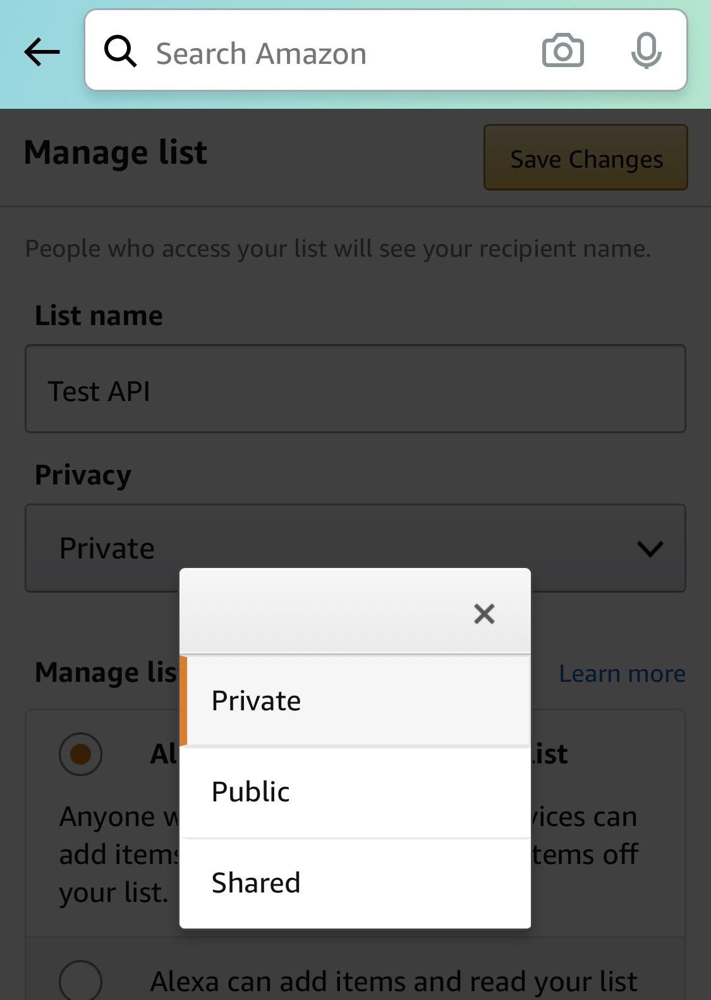
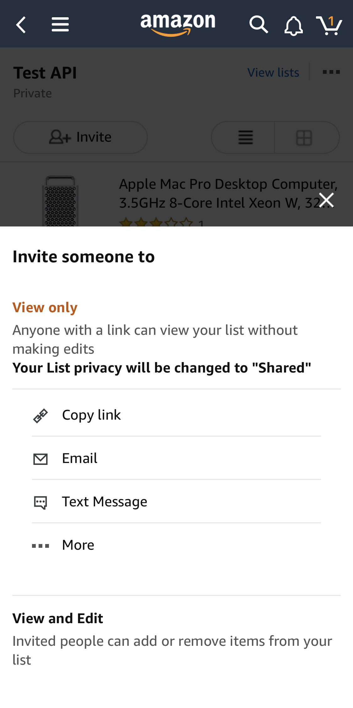
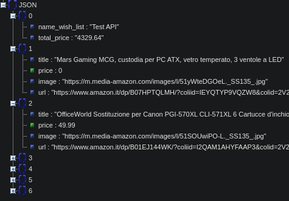

# Amazon WishList Wrapper

[](https://paypal.me/fast0n)  [](https://travis-ci.org/Fast0n/AmazonWishListWrapper) [](https://github.com/Fast0n/AmazonWishListWrapper/LICENSE)

## How does it work

Create a json file of your favorite Amazon wish list


### From Terminal

Download the repo, install the dependencies with:

```
npm install
```

Start the project with:
```
node server.js
```

### From Smartphone

Create a non-private wish list:




Copy the list link in Read Only mode:




Create the request with:
```
http://localhost:1337/get/?url=https://www.amazon.it/hz/wishlist/ls/2V2Y0A60MWU34?ref_=wl_share
```


## Risult



```
Copyright [2020] [Massimiliano Montaleone]

Licensed under the Apache License, Version 2.0 (the "License");
you may not use this file except in compliance with the License.
You may obtain a copy of the License at

    http://www.apache.org/licenses/LICENSE-2.0

Unless required by applicable law or agreed to in writing, software
distributed under the License is distributed on an "AS IS" BASIS,
WITHOUT WARRANTIES OR CONDITIONS OF ANY KIND, either express or implied.
See the License for the specific language governing permissions and
limitations under the License.
```